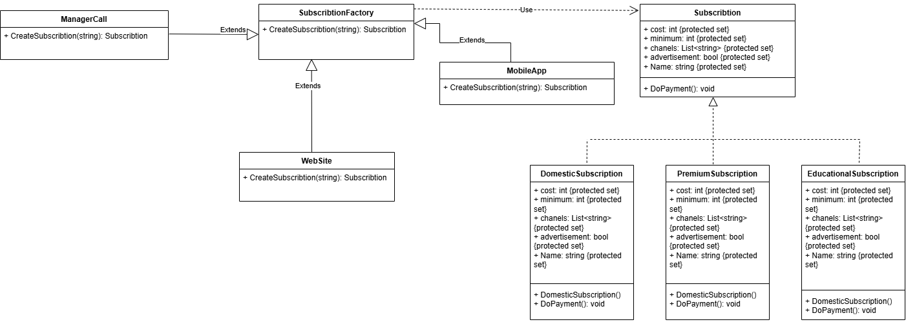
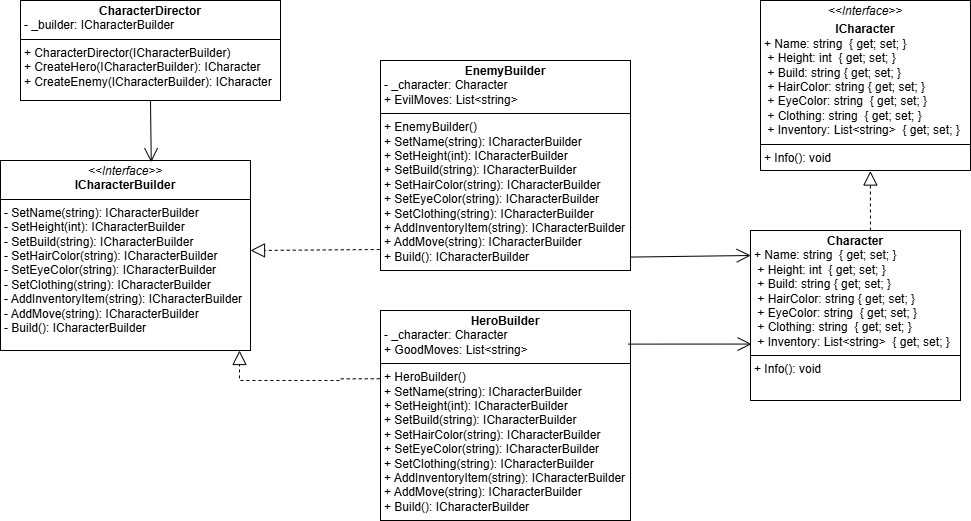

## Fabric Method
### Structure
1) [Abstract factory](https://github.com/ipsolver/KPZ/blob/lab-2/pr2/pr2/Task1/SubscribtionFactory.cs)

It defines the method:
- CreateSubscribtion
2) [Abstract class](https://github.com/ipsolver/KPZ/blob/lab-2/pr2/pr2/Task1/Subscribtion.cs)

It defines there properties:
- int cost
- int minimum
-  List<string> chanels
-  bool advertisement
- string Name

And method:
- void DoPayment()

3) Specific classes:
- [DomesticSubscription](https://github.com/ipsolver/KPZ/blob/lab-2/pr2/pr2/Task1/DomesticSubscription.cs)
- [EducationalSubscription](https://github.com/ipsolver/KPZ/blob/lab-2/pr2/pr2/Task1/EducationalSubscription.cs)
- [PremiumSubscription](https://github.com/ipsolver/KPZ/blob/lab-2/pr2/pr2/Task1/PremiumSubscription.cs)

 - - These classes implement the abstract Subscription class.
   - They also have constructors with "built-in" values ​​according to the subscription.
   - Implement the `DoPayment()` method to output information
4) Specific factories:
- WebSite
- MobileApp
- ManagerCall

### Result
- The factory method is implemented through: `Abstract class SubscriptionFactory`, which defines the CreateSubscription() method.
- Concrete factories (WebSite, MobileApp, ManagerCall) that [override CreateSubscription()](https://github.com/ipsolver/KPZ/blob/lab-2/pr2/pr2/Task1/MobileApp.cs#L11).


## Abstract Factory
### Structure
1) [Abstract factory](https://github.com/ipsolver/KPZ/blob/lab-2/pr2/pr2/Task2/Interfaces/IDeviceFactory.cs)

Defines such methods:
- CreateLaptop
- CreateNetbook
- CreateEBook
- CreateSmartphone

2) Interfaces:
- [IEBook](https://github.com/ipsolver/KPZ/blob/lab-2/pr2/pr2/Task2/Interfaces/IEBook.cs)
- [ILaptop](https://github.com/ipsolver/KPZ/blob/lab-2/pr2/pr2/Task2/Interfaces/ILaptop.cs)
- [INetbook](https://github.com/ipsolver/KPZ/blob/lab-2/pr2/pr2/Task2/Interfaces/INetbook.cs)
- [ISmartphone](https://github.com/ipsolver/KPZ/blob/lab-2/pr2/pr2/Task2/Interfaces/ISmartphone.cs)

These have properties:
- string Name { get; }
- float Price {  get; }

And method:
- void Info();

3) Specific factories:
- [KiaomiFactory](https://github.com/ipsolver/KPZ/blob/lab-2/pr2/pr2/Task2/Classes/KiaomiFactory.cs)
- [IProneFactory](https://github.com/ipsolver/KPZ/blob/lab-2/pr2/pr2/Task2/Classes/IProneFactory.cs)
- [BalaxyFactory](https://github.com/ipsolver/KPZ/blob/lab-2/pr2/pr2/Task2/Classes/BalaxyFactory.cs)

They accordingly determine the methods:
- ILaptop CreateLaptop()
- INetbook CreateNetbook()
- IEBook CreateEBook()
- ISmartphone CreateSmartphone()

Each factory implements IDeviceFactory and returns the corresponding products of its brand 

4) Products:
------------------
- [BalaxySmartphone](https://github.com/ipsolver/KPZ/blob/lab-2/pr2/pr2/Task2/Products/BalaxySmartphone.cs)
- [BalaxyNetbook](https://github.com/ipsolver/KPZ/blob/lab-2/pr2/pr2/Task2/Products/BalaxyNetbook.cs)
- [BalaxyLaptop](https://github.com/ipsolver/KPZ/blob/lab-2/pr2/pr2/Task2/Products/BalaxyLaptop.cs)
- [BalaxyEBook](https://github.com/ipsolver/KPZ/blob/lab-2/pr2/pr2/Task2/Products/BalaxyEBook.cs)
------------------
- [IProneSmartphone](https://github.com/ipsolver/KPZ/blob/lab-2/pr2/pr2/Task2/Products/IProneSmartphone.cs)
- [IProneNetbook](https://github.com/ipsolver/KPZ/blob/lab-2/pr2/pr2/Task2/Products/IProneNetbook.cs)
- [IProneLaptop](https://github.com/ipsolver/KPZ/blob/lab-2/pr2/pr2/Task2/Products/IProneLaptop.cs)
- [IProneEBook](https://github.com/ipsolver/KPZ/blob/lab-2/pr2/pr2/Task2/Products/IProneEBook.cs)
------------------
- [KiaomiSmartphone](https://github.com/ipsolver/KPZ/blob/lab-2/pr2/pr2/Task2/Products/KiaomiSmartphone.cs)
- [KiaomiNetbook](https://github.com/ipsolver/KPZ/blob/lab-2/pr2/pr2/Task2/Products/KiaomiNetbook.cs)
- [KiaomiLaptop](https://github.com/ipsolver/KPZ/blob/lab-2/pr2/pr2/Task2/Products/KiaomiLaptop.cs)
- [KiaomiEBook](https://github.com/ipsolver/KPZ/blob/lab-2/pr2/pr2/Task2/Products/KiaomiEBook.cs)

### Result

The Abstract Factory pattern allows for flexible control over the creation of objects, supports the "openness/closedness" principle, and simplifies the expansion of the project with new devices or brands.

For adding a new brand only you should create a new factory and corresponding product classes without changing existing code
<hr>

## Authenticator Singleton Pattern
### Class: Authenticator
The `Authenticator` class is designed to authenticate users while ensuring that only a single instance of it exists throughout the program's lifecycle.
### Implementation Details
#### Properties and Fields:
- [Stores the single instance of Authenticator](https://github.com/ipsolver/KPZ/blob/lab-2/pr2/pr2/Task3/Authenticator.cs#L11).
- [Synchronization lock for thread safety](https://github.com/ipsolver/KPZ/blob/lab-2/pr2/pr2/Task3/Authenticator.cs#L12)
- [Provides global access to the single instance, ensuring thread safety](https://github.com/ipsolver/KPZ/blob/lab-2/pr2/pr2/Task3/Authenticator.cs#L14)
- [Ensuring protection against class inheritance with `sealed`](https://github.com/ipsolver/KPZ/blob/lab-2/pr2/pr2/Task3/Authenticator.cs#L9)
- Private static lockObject for thread synchronization
### What else?
- Private Constructor: Prevents external instantiation of the class
- Authenticate(): Demonstrates instance usage.
## Expected Output
```
Authenticating user1 with password my_password
Authenticating user2 with password your_password
Are user1 and user2 the same? True
```
The check was done with ReferenceEquals

<hr>

## Prototype
### Structure
1) [Class `Virus`](https://github.com/ipsolver/KPZ/blob/lab-2/pr2/pr2/Task4/Virus.cs)

Properties:
- float masa { get; set; }
- int age { get; set; }
- string name { get; set; }
- string type { get; set; }
- List< 'Virus' > children { get; set; }

Methods:

- [constructor Virus(float masa, int age, string name, string type)](https://github.com/ipsolver/KPZ/blob/lab-2/pr2/pr2/Task4/Virus.cs#L18)
- [void AddChild(Virus child)](https://github.com/ipsolver/KPZ/blob/lab-2/pr2/pr2/Task4/Virus.cs#L26) - method for adding "children" and creates generations
- [void Show(int level=0)](https://github.com/ipsolver/KPZ/blob/lab-2/pr2/pr2/Task4/Virus.cs#L30) - method for output info about group viruses from the class
- [object Clone()](https://github.com/ipsolver/KPZ/blob/lab-2/pr2/pr2/Task4/Virus.cs#L38) - standart object method for clone 

Interfaces:
- `ICloneable` - builded interface for making copies

Result:
- Shallow Copy using `MemberwiseClone()`
This creates a shallow copy, duplicating the primitive fields
- [Deep Copy of children List](https://github.com/ipsolver/KPZ/blob/lab-2/pr2/pr2/Task4/Virus.cs#L41-L46)
A new list is created to hold the deep-copied children.
Each child virus is recursively cloned and added to the new list.

- Each cloned Virus instance has its own independent copy of the children list.
- Modifying the child elements of the original Virus does not affect the cloned instance.


<hr>

## Builder
### Structure

1) Interfaces:
- [ICharacter](https://github.com/ipsolver/KPZ/blob/lab-2/pr2/pr2/Task5/Interfaces/ICharacter.cs)
Defines the basic interface for characters.

Properties:
- - string Name { get; set; }
- - int Height { get; set; }
- - string Build { get; set; }
- - string HairColor { get; set; }
- - string EyeColor { get; set; }
- - string Clothing { get; set; }
- - List<'string'> Inventory { get; set; }

Method:
- - void Info();

- [ICharacterBuilder](https://github.com/ipsolver/KPZ/blob/lab-2/pr2/pr2/Task5/Interfaces/ICharacterBuilder.cs)
Character creation interface with parameter setting methods.

Methods:
- - ICharacterBuilder SetName(string name);
- - ICharacterBuilder SetHeight(int height);
- - ICharacterBuilder SetBuild(string build);
- - ICharacterBuilder SetHairColor(string hairColor);
- - ICharacterBuilder SetEyeColor(string eyeColor);
- - ICharacterBuilder SetClothing(string clothing);
- - ICharacterBuilder AddInventoryItem(string item);
- - ICharacterBuilder AddMove(string move);
- - ICharacter Build();

2) Classes:
- [Character](https://github.com/ipsolver/KPZ/blob/lab-2/pr2/pr2/Task5/Classes/Character.cs) — implements the ICharacter interface, represents the final character.
- [HeroBuilder](https://github.com/ipsolver/KPZ/blob/lab-2/pr2/pr2/Task5/Classes/HeroBuilder.cs) — a builder for creating a hero character.
- [EnemyBuilder](https://github.com/ipsolver/KPZ/blob/lab-2/pr2/pr2/Task5/Classes/EnemyBuilder.cs) — a builder for creating an enemy character.
- [CharacterDirector](https://github.com/ipsolver/KPZ/blob/lab-2/pr2/pr2/Task5/Classes/CharacterDirector.cs) — a class that manages the character building process.

3) Main methods:
- [CreateHero(ICharacterBuilder builder)](https://github.com/ipsolver/KPZ/blob/lab-2/pr2/pr2/Task5/Classes/CharacterDirector.cs#L19) — creates a hero with certain characteristics.
- [CreateEnemy(ICharacterBuilder builder)](https://github.com/ipsolver/KPZ/blob/lab-2/pr2/pr2/Task5/Classes/CharacterDirector.cs#L34) — creates an enemy with certain characteristics.

### Usage
1) Flexible creating builders

```
ICharacterBuilder heroBuilder = new HeroBuilder();
ICharacterBuilder enemyBuilder = new EnemyBuilder();
```
2) Creating characters
Characters are created using the CharacterDirector class, which takes a builder as input and constructs the character. You can create heroes and enemies
```
CharacterDirector director = new CharacterDirector(heroBuilder);
ICharacter hero = director.CreateHero(heroBuilder);
Console.WriteLine("Герой:");
hero.Info();

CharacterDirector director = new CharacterDirector(enemyBuilder);
ICharacter enemy = director.CreateEnemy(enemyBuilder);
Console.WriteLine("Ворог:");
enemy.Info();
```
3) Displaying character information

```
hero.Info();
enemy.Info();
```
## Result

This implementation allows you to flexibly create different characters, change their characteristics, and expand the game's capabilities using the "Builder" pattern.

<hr>

## UML-diagrams
### Abstract Factory

### Factory method

### Builder

